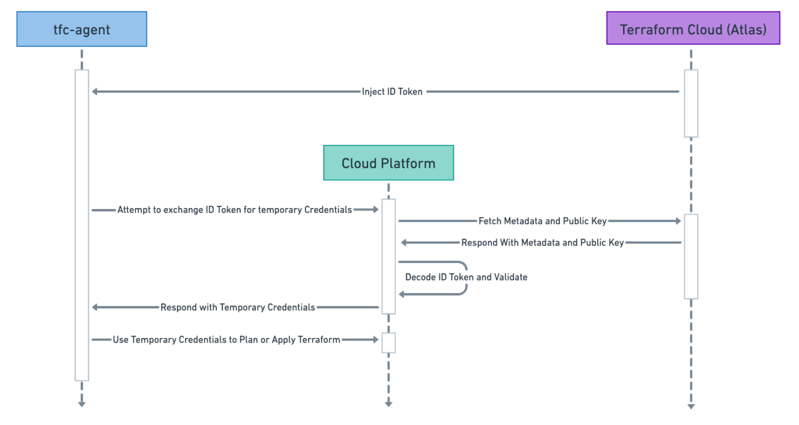
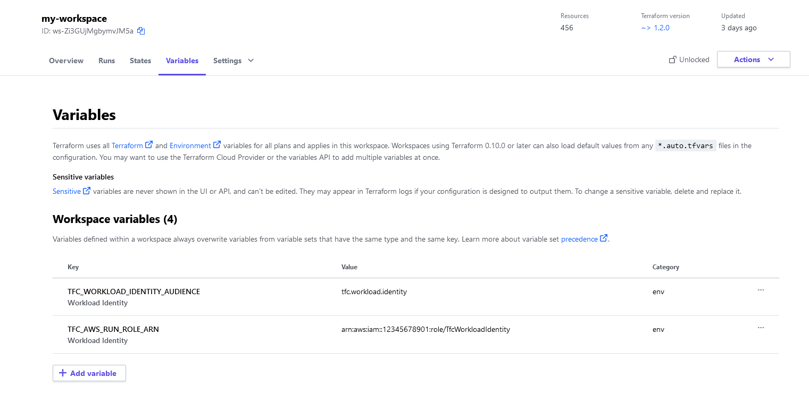
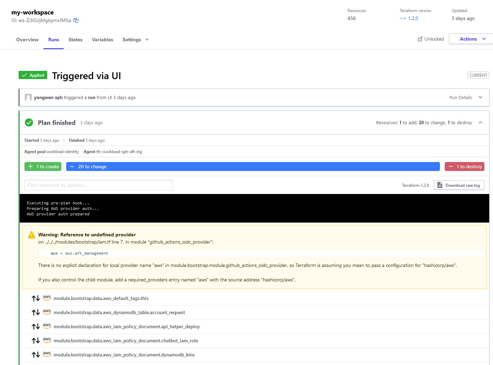

# Terraform Cloud Workload Identity for AWS

Assuming AWS IAM Roles from workspaces

---
## Introduction

- Assume IAM Roles from Terraform Cloud/Terraform Enterprise
- **Requires Terraform Cloud/Enterprise Agents**

---
# Why?

- No more static AWS Credentials on TFC
- No more secrets rotation (manual or otherwise)
- No more complicated Vault setup
- Secure ephemeral and dynamic credentials used to interact with AWS APIs

---


---
## Setup

- Setup OIDC Provider in AWS
- Crete IAM role with appropriate trust policy
- Deploy TFC Agents with pre-plan and pre-apply hooks
- Add environment variables in TFC

---


## OIDC Tokens

```json
{
  "typ": "JWT",
  "alg": "RS256",
  "kid": "j-fFp9evPJAzV5I2_58HY5UvdCK6Q4LLB1rnPOUfQAk"
}
{
  "jti": "1192426d-b525-4fde-9d42-f238be437bbd",
  "iss": "https://app.terraform.io",
  "aud": "my-example-audience",
  "iat": 1650486122,
  "nbf": 1650486117,
  "exp": 1650486422,
  "sub": "organization:my-organization-name:workspace:my-workspace-name:run_phase:apply",
  "terraform_run_phase": "apply",
  "terraform_workspace_id": "ws-mbsd5E3Ktt5Rg2Xm",
  "terraform_workspace_name": "my-example-workspace",
  "terraform_organization_id": "org-GRNbCjYNpBB6NEH9",
  "terraform_organization_name": "my-example-organization",
  "terraform_run_id": "run-X3n1AUXNGWbfECsJ"
}
```

Injected as environment variable `TFC_WORKLOAD_IDENTITY_TOKEN`

---
## `aud` and `sub`

- `sts:AssumeRoleWithWebIdentity`
- IAM Conditions only [supports](https://docs.aws.amazon.com/IAM/latest/UserGuide/reference_policies_iam-condition-keys.html#condition-keys-wif) matching on `aud` and `sub`.

---
## AWS Setup

- Module published at https://github.com/SPHTech-Platform/terraform-aws-tfc-workload-identity

```hcl
module "tfc" {
  source  = "SPHTech-Platform/tfc-workload-identity/aws"
  version = "~> 0.1.0"

  tfc_oidc_provider_audiences = ["tfc.workload.identity"]
  tfc_workload_identity_workspaces = {
    my-org = [
      "my-workspace",
    ]
    my-second-org = [
      "special-workspaces-*,
    ]
  }
}
```

---
### OpenID Connect Provider

```hcl
locals {
    oidc_provider_url = "https://app.terraform.io"

}

data "tls_certificate" "tfc_certificate" {
  url = local.oidc_provider_url
}

resource "aws_iam_openid_connect_provider" "tfc_provider" {
  url            = local.oidc_provider_url
  client_id_list = ["tfc.workload.identity"]
  thumbprint_list = [
    data.tls_certificate.tfc_certificate.certificates.0.sha1_fingerprint,
  ]
}

```

---
### IAM Role

```hcl
module "tfc_workload_identity_role" {
  source  = "terraform-aws-modules/iam/aws//modules/iam-assumable-role-with-oidc"
  version = "~> 5.3.0"

  create_role = true

  role_name = "tfc"
  role_policy_arns = [
    "arn:aws:iam::aws:policy/AdministratorAccess",
  ]

  provider_url = aws_iam_openid_connect_provider.tfc_provider.url

  oidc_subjects_with_wildcards   = ["organization:my-organization-name:workspace:my-workspace-name:run_phase:*"]
  oidc_fully_qualified_audiences = ["tfc.workload.identity"]
}

```

---
### IAM Role Trust Policy

```json
{
    "Version": "2012-10-17",
    "Statement": [
        {
            "Sid": "",
            "Effect": "Allow",
            "Principal": {
                "Federated": "arn:aws:iam::123456789001:oidc-provider/app.terraform.io"
            },
            "Action": "sts:AssumeRoleWithWebIdentity",
            "Condition": {
                "StringLike": {
                    "app.terraform.io:aud": "tfc.workload.identity",
                    "app.terraform.io:sub": "organization:my-org:workspace:my-workspaces:run_phase:*"
                }
            }
        }
    ]
}
```

---
## TFC Agents

- Write injected OIDC Token to a file
- Use [hooks](https://gist.github.com/lawliet89/71ffbe17e8eb38d892e5ce3e243a0829) to configure AWS Provider to use web identity federation
- Beware of AWS Provider credentials [precedence](https://registry.terraform.io/providers/hashicorp/aws/latest/docs#authentication-and-configuration)!

---
### Hooks

```sh
#!/bin/bash
set -euo pipefail

if [ -z ${TFC_AWS_APPLY_ROLE_ARN+x} ] && [ -z ${TFC_AWS_RUN_ROLE_ARN+x} ]; then
  echo "Skipping this script because both env vars are missing and unset";
  else
  set +u
  ROLE_ARN="${TFC_AWS_APPLY_ROLE_ARN:-$TFC_AWS_RUN_ROLE_ARN}"
  set -u
  echo "Preparing AWS provider auth..."

  # Remove any previous identity tokens
  rm -f /.aws-workload/token-file
  echo "${TFC_WORKLOAD_IDENTITY_TOKEN}" > /.aws-workload/token-file

  mkdir ~/.aws
  rm -f ~/.aws/config
  {
    echo "[default]"
    echo "role_arn=${ROLE_ARN}"
    echo "web_identity_token_file=/.aws-workload/token-file"
    echo "role_session_name=${TFC_RUN_ID}"
  } >> ~/.aws/config

  echo "AWS provider auth prepared"
fi
```

---
## TFC Workspace Environment Variables

- `TFC_WORKLOAD_IDENTITY_AUDIENCE` - Audience that must match the values in the OIDC proider and
  the IAM Role Trust policy.
- `TFC_AWS_RUN_ROLE_ARN`: ARN of IAM Role to be assumed or,

  - `TFC_AWS_PLAN_ROLE_ARN`: Plan role
  - `TFC_AWS_APPLY_ROLE_ARN`: Apply role

---


---


---
## Wishlist

- `sts:AssumeRoleWithWebIdentity` to support arbitrary OIDC claims
- Match OIDC token against workspace tags
